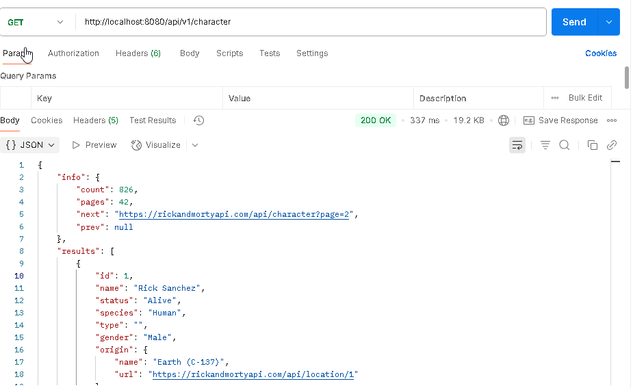
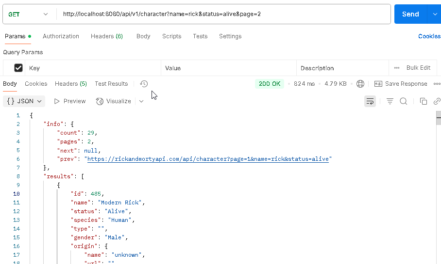
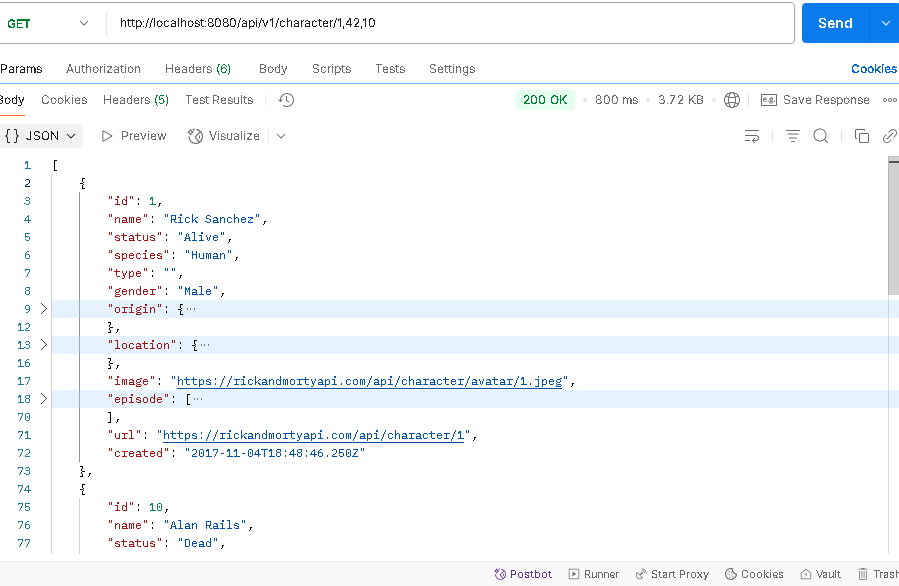

# Rick and Morty API Consumer 🛸

Este es un proyecto backend desarrollado con **Spring Boot**, cuyo propósito es consumir la [API pública de Rick and Morty](https://rickandmortyapi.com/) y exponer endpoints para su uso por parte de un frontend.

---

## 🚀 Características

- Obtener todos los personajes paginados.
- Filtrar personajes por nombre, estado, género, especie o tipo ,etc.
- Buscar un personaje por su ID.
- Buscar múltiples personajes por una lista de IDs.

---

## 🧱 Tecnologías utilizadas

- Java 21
- Spring Boot 3.x
- Spring Web
- Spring Cloud OpenFeign (cliente REST declarativo)
- Lombok
- Maven
- API externa: [https://rickandmortyapi.com](https://rickandmortyapi.com)

---

## 📂 Estructura del proyecto

src/  
└── main/  
├── java/  
│ └── com.pruebatecnica.rickandmortyapi/  
│ ├── controller/  
│ ├── service/  
│ ├── client/  
│ ├── model/  
│ └── shared/  
└── resources/  
└── application.yml  

---

## 📡 Endpoints disponibles

### 🔍 Buscar personajes con filtros
>GET /api/v1/character
#### Parámetros opcionales:

- `name` → Filtra por nombre.
- `status` → Filtra por estado (`alive`, `dead`, `unknown`).
- `species` → Filtra por especie.
- `type` → Filtra por tipo.
- `gender` → Filtra por género (`male`, `female`, `genderless`, `unknown`).
- `page` → Número de página (por defecto: 1).

>GET /api/v1/character   
> muestra todos los personajes  por defecto pagina =1 



>GET /api/v1/character?name=rick&status=alive&page=2   
> muestra los personajes nombre = rick y su estado vivo que este enl pagina 2


---

### 🔎 Obtener un personaje por un ID o varios IDS

>GET /api/v1/character/{id}
>Busqueda por un solo id devuelve solo un personaje 


>GET /api/v1/character/{id1,id2,...
>Busqueda por varios ids devuelve una lista de personajes


> Si se pasa solo un ID, retorna un único personaje.  
> Si se pasan varios, retorna una lista.

---

## ▶️ Cómo ejecutar el proyecto

### ⚙️ Requisitos previos

- Java 17 o superior instalado
- Maven instalado
- Conexión a Internet (para consumir la API externa)

### 🛠️ Pasos para ejecutar localmente

1. **Clona el repositorio**


```bash
git clone https://github.com/Rojoxt/rick-and-morty-api.git
```

2. **Navega al directorio del proyecto**

```bash
cd rick-and-morty-api
```
3. **Compila y ejecuta el proyecto**
```bash
mvn spring-boot:run
```
4. **Accede a la API en tu navegador o herramienta RES**

```bash
http://localhost:8080/api/v1/character
```
---
### 🧪 Ejemplos de prueba

A continuación se presentan algunos ejemplos para probar los endpoints del backend:

#### 🔹 Obtener todos los personajes
```GET http://localhost:8080/api/v1/character*/```

#### 🔹 Obtener personajes filtrados

Filtra por nombre y estado (por ejemplo, "Rick" que esté "alive"):

```GET http://localhost:8080/api/v1/character?name=rick&status=alive```


Filtra por género y especie:

```GET http://localhost:8080/api/v1/character?gender=male&species=Human```

#### 🔹 Obtener un personaje por ID

```GET http://localhost:8080/api/v1/character/1```

#### 🔹 Obtener múltiples personajes por IDs

```GET http://localhost:8080/api/v1/character/1,2,3```

> ⚠️ Si se pasa un solo ID, retorna un objeto `RickAndMortyCharacter`.  
> Si se pasan múltiples IDs separados por comas, retorna una lista de personajes.

# La logica es similar para locacion y episodios **

Puedes probar los endpoints manualmente usando herramientas como Postman, Insomnia o directamente desde el navegador para solicitudes simples `GET`.

Además, este proyecto cuenta con documentación automática utilizando **Swagger**, accesible en:

http://localhost:8080/swagger-ui/index.html

Allí podrás:

- Visualizar todos los endpoints disponibles.
- Probarlos directamente desde la interfaz.
- Ver la estructura de las respuestas y parámetros esperados.
---